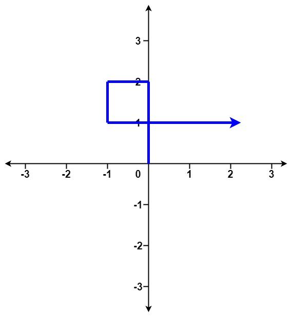
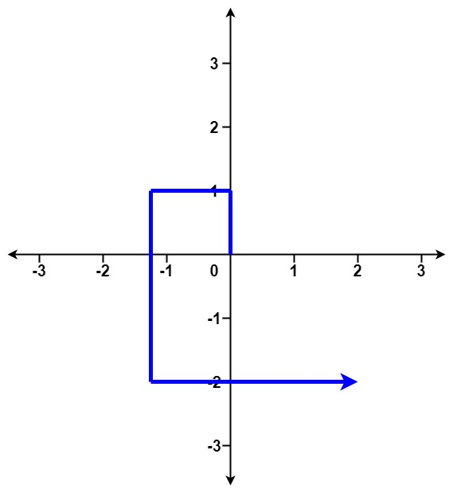
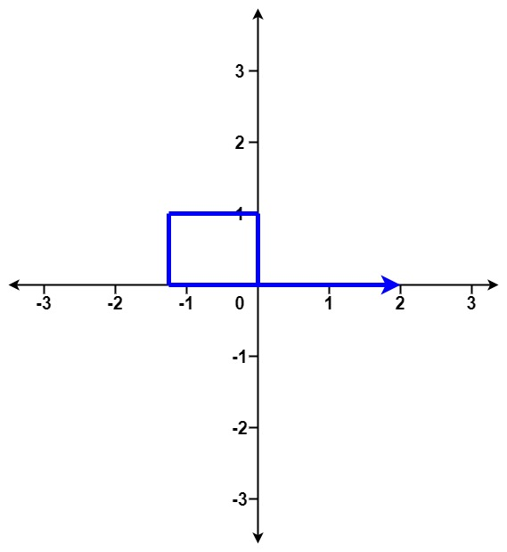

**335. 路径交叉**
- 给你一个整数数组 distance 。
- 从 X-Y 平面上的点 (0,0) 开始，先向北移动 distance[0] 米，然后向西移动 distance[1] 米，向南移动 distance[2] 米，向东移动 distance[3] 米，持续移动。也就是说，每次移动后你的方位会发生逆时针变化。
- 判断你所经过的路径是否相交。如果相交，返回 true ；否则，返回 false 。

示例 1：

```
输入：distance = [2,1,1,2]
输出：true
```
示例 2：

```
输入：distance = [1,2,3,4]
输出：false
```
示例 3：

```
输入：distance = [1,1,1,1]
输出：true
```

提示：
- 1 <= distance.length <= 10^5
- 1 <= distance[i] <= 10^5